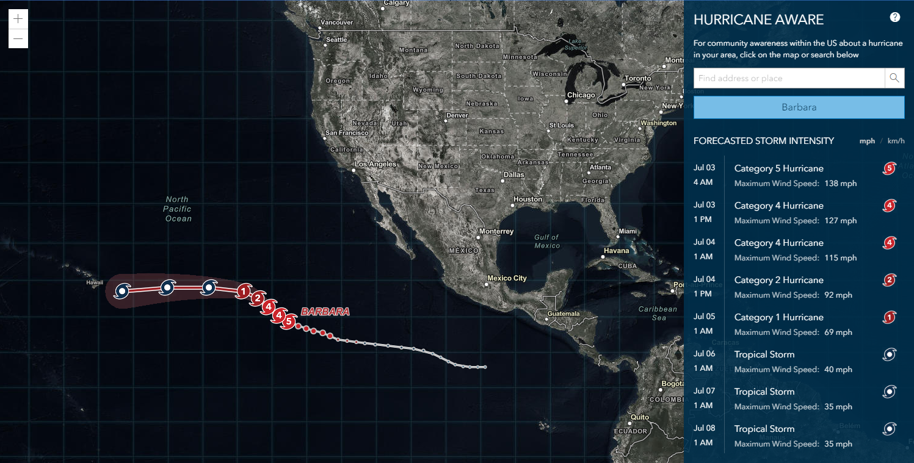

# Hurrican Aware App

The HurricaneAware app is intended to provide information about the potential impacts of tropical storms in the United States. 

[View it live](https://livingatlas.arcgis.com/hurricane/)

## Features
Click on a location in the U.S. to see the timing of weather impacts along with affected populations. You can also individually select a storm to find out detailed forecast information. While track forecasts are provided for areas outside the U.S., other weather forecasts and demographic data is not available.

## Requirements

- [ArcGIS API for JavaScript (version 4.12)](https://developers.arcgis.com/javascript/index.html)
- [D3.js](https://d3js.org/)
- [React.js](https://reactjs.org/)

## Resources
The Active Hurricane data used by this app is available on [ArcGIS Living Atlas of the World](https://livingatlas.arcgis.com/en/browse/#d=2&cont=esriOnly&q=active%20hurricanes)

## Issues

Find a bug or want to request a new feature?  Please let us know by submitting an issue.

## Contributing

Esri welcomes contributions from anyone and everyone. Please see our [guidelines for contributing](https://github.com/esri/contributing).

## Licensing
Copyright 2019 Esri

Licensed under the Apache License, Version 2.0 (the "License");
you may not use this file except in compliance with the License.
You may obtain a copy of the License at

   http://www.apache.org/licenses/LICENSE-2.0

Unless required by applicable law or agreed to in writing, software
distributed under the License is distributed on an "AS IS" BASIS,
WITHOUT WARRANTIES OR CONDITIONS OF ANY KIND, either express or implied.
See the License for the specific language governing permissions and
limitations under the License.

A copy of the license is available in the repository's [license.txt](license.txt) file.